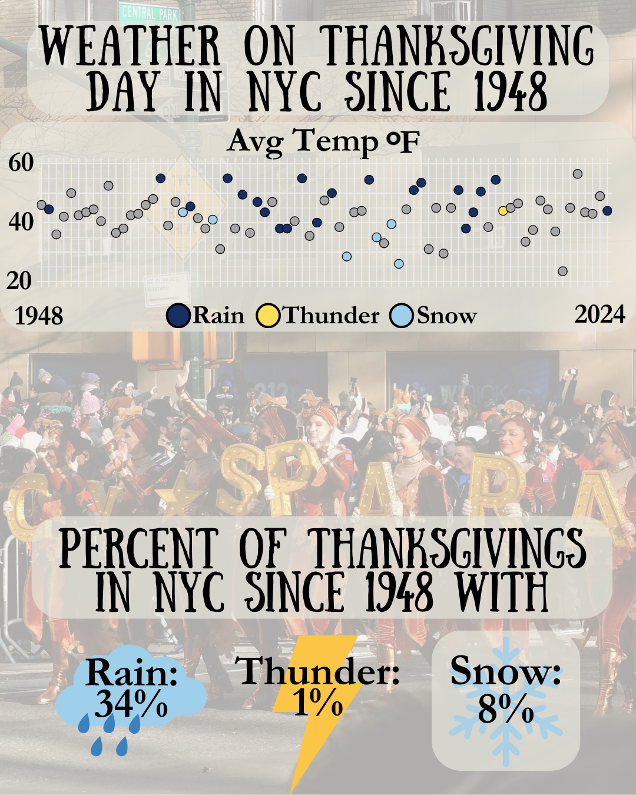

{.lightbox width="50%"}

## About

Weather in NYC for the past 77 Thanksgivings.  About 80% of Thanksgivings had an average temperature between 30-50F.  It's rained on 34% of the previous Thanksgivings.  The warmest year in the dataset was 2020 with a temp of 66 and the coldest was in 2018 with a max temp of 29, yikes!

**Data source:** NOAA, JFK International Airport Weather Station

## Code

```{r}
#| eval: false
library(tidyr)
library(ggplot2)
library(RColorBrewer)
library(pheatmap)

setwd("MacysParade/code")

# read in weather data
data <- read.csv("../data-raw/NOAA_JFK_Station.csv")
head(data)


# Create dataframe of thanksgivings
tgiving <- data.frame(year = 1924:2024)


# Function to calculate Thanksgiving for a given year
get_thanksgiving <- function(year) {
  # Start with November 1 of the given year
  first_day <- as.Date(paste0(year, "-11-01"))
  
  # Find the weekday of November 1 (1 = Sunday, ..., 7 = Saturday)
  weekday <- as.integer(format(first_day, "%u"))
  
  # Calculate the offset to the first Thursday (4 = Thursday)
  offset_to_thursday <- ifelse(weekday <= 4, 4 - weekday, 11 - weekday)
  
  # Add 3 more weeks (21 days) to get to the fourth Thursday
  thanksgiving <- first_day + offset_to_thursday + 21
  
  return(thanksgiving)
}

# get date of thanksgiving for each year
tgiving$date <- get_thanksgiving(tgiving$year)
tgiving$date <- as.character(tgiving$date)

# add weather data
tgiving <- tgiving %>%
  left_join(data, by = c("date" = "DATE"))

tg <- tgiving %>%
  select(year, date, STATION, NAME, TMAX, TMIN, WSFG,
         WT03, WT04, WT05, WT09, WT11, WT16, WT17, WT18)

# remove dates without weather data
tg <- tg %>% filter(!is.na(STATION))


# WSFG: Peak wind gust speed
# TS:03 (WT03) - Thunder
# PL:04 (WT04) - Ice pellets, sleet, snow pellets or small hail
# GR:05 (WT05) - Hail (may include small hail)
# BLSN:09 (WT09) - Blowing or drifting snow
# WIND:11 (WT11) - High or damaging winds
# RA:16 (WT16) - Rain
# FZRA:17 (WT17) - Freezing rain
# SN:18 (WT18) - Snow, snow pellets, snow grains or ice crystals


tg <- tg %>%
  rename(
    Thunder = WT03,
    Ice_Sleet = WT04,
    Hail = WT05,
    Blowing_Snow = WT09,
    High_Winds = WT11,
    Rain = WT16,
    Freeze_Rain = WT17,
    Snow = WT18
  )

# manually add in today - Thanksgiving 2024
add <- tg[1,]
add$year <- 2024
add$date <- '2024-11-28'
add$TMAX <- 49
add$TMIN <- 39
add$Rain <- 1


tg <- rbind(tg, add)  

# calculate avg temp per day
tg$TAVG <- (tg$TMIN + tg$TMAX)/2


tg <- tg %>%
  mutate(weather = case_when(
    Thunder == 1 ~ "Thunder",
    Snow == 1 ~ "Snow",
    Rain == 1 ~ "Rain",
    TRUE ~ ""
  ))

avg <- mean(tg$TAVG)

min_temp <- min(tg$TAVG)
max_temp <- max(tg$TAVG)

ggplot(tg, aes(x = date, y = TAVG, color = weather, fill = weather)) +
  geom_point(size = 3.5, shape = 21, color = "black") +
  scale_fill_manual(values = c("#E7E6DD", "#162F65", "#3361AC", "#E8AF30")) + 
  ylab("") +
  xlab("") +
  scale_y_continuous(
    limits = c(20, 60),         # Set range
    breaks = seq(20, 60, by = 10) # Define increments
  ) +
  theme_minimal() +
  theme(axis.text.x = element_blank()) +
  theme(axis.text.y = element_text(size = 18)) +
  theme(axis.title.y = element_text(size = 18)) +
  theme(legend.position = "none") +
  theme(
    panel.background = element_rect(fill = "transparent", color = NA),  # Panel background
    plot.background = element_rect(fill = "transparent", color = NA)   # Overall plot background
  )

ggsave("../results/average_temp_per_year_dotplot_1958_2024.pdf", bg = "transparent", width = 8, height = 2)

  # theme(axis.text.x = element_text(angle = 90, hjust = 1, vjust = 0.5)) +
  # geom_hline(yintercept = avg, linetype = "dashed", linewidth = 1)


tg$Day <- "Thanksgiving"
tg$order <- ifelse(tg$weather == "", 1, 2)

ggplot(tg %>% arrange(order),
       aes(x = Day, y = TAVG)) +
  geom_boxplot(outlier.shape = NA) +
  geom_jitter(size = 4,
              shape = 21,
              color = "black",
              width = 0.3,
             aes(fill = weather)) +
  scale_fill_manual(values = c("#E7E6DD", "#162F65", "#3361AC", "#E8AF30")) + 
  ylab("Average Temperature in NYC (F)") +
  xlab("") +
  scale_y_continuous(
    limits = c(20, 60),         # Set range
    breaks = seq(20, 60, by = 10) # Define increments
  ) +
  theme_minimal() +
  theme(axis.text.x = element_blank()) +
  theme(axis.text.y = element_text(size = 18)) +
  theme(axis.title.y = element_text(size = 18)) +
  theme(
    panel.background = element_rect(fill = "transparent", color = NA),  # Panel background
    plot.background = element_rect(fill = "transparent", color = NA)   # Overall plot background
  )

 ggsave("../results/average_temp_per_year_1958_2024.pdf", bg = "transparent", width = 4, height = 6)


# what percent of the parades had rain
rain <- length(!is.na(tg$Rain))

total <- nrow(tg)
rain <- tg %>% filter(Rain == 1) %>% nrow()
rain/total * 100

snow <- tg %>% filter(Snow == 1) %>% nrow()
snow/total * 100

thunder <- tg %>% filter(Thunder == 1) %>% nrow()
thunder/total * 100

weather <- tg %>% filter(weather != "") %>% nrow()
weather/total * 100

# avg temp between 30 and 50:
temps <- tg %>% filter(TAVG >= 30 & TAVG <= 50) %>% nrow()
temps/total * 100

# max temps below 50
temps <- tg %>% filter(TMAX < 50) %>% nrow()
temps/total * 100

# max temps below 50
temps <- tg %>% filter(TMAX < 40) %>% nrow()
temps/total * 100
```
