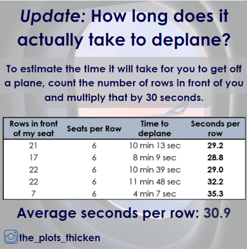

{.lightbox width="50%"}

## About

Ever wondered how long it actually takes to get off a plane once it lands?  It can often feel like forever....but now you can count down the estimated minutes until you're free!
  Make sure to count the actual number of rows in front of you as many planes skip rows, then take the number of rows and multiply that by 30 seconds

**Data Collection:** Timing starts when the captain turns off the fasten seatbelt sign at the gate and ends when I step off the plane.

