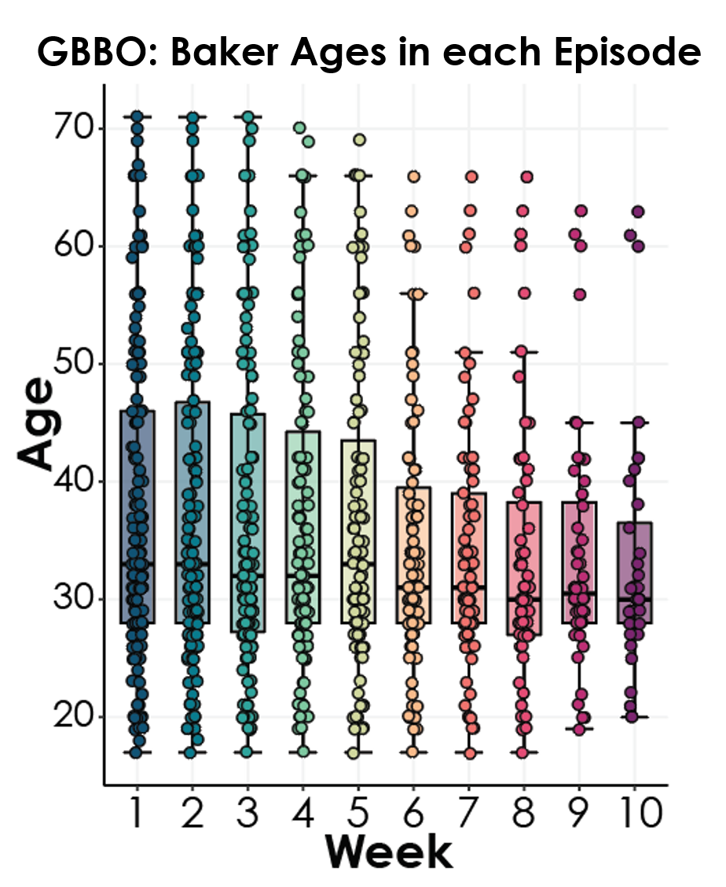

{.lightbox width="50%"}

## About

The majority of the bakers are younger as the episodes go on and 50% of the bakers in the final episode are between 28 and 37.  Only 3 bakers 60 years or older have ever made it to the last episode.


**Data source:** 

## Code

```{r}
#| eval: false
setwd("gbbo/code")

library(dplyr)
library(readxl)
library(ggplot2)
library(ggforce)
library(ggridges)
library(ggbeeswarm)
library(data.table)

# parameters
my_theme <- theme(
  plot.title = element_text(face = "bold",
                                  size = rel(1.2), hjust = 0.5),
        text = element_text(size = 18, face = "bold"),
        axis.title = element_text(face = "bold",size = rel(1)),
        axis.title.y = element_text(angle=90,vjust =2),
        axis.title.x = element_text(vjust = -0.2),
        axis.text = element_text(), 
        axis.line.x = element_line(colour="black"),
        axis.line.y = element_line(colour="black"),
        axis.ticks = element_line(),
        panel.grid.major = element_line(colour="#f0f0f0"),
        panel.grid.minor = element_blank(),
        #strip.background=element_rect(colour="#f0f0f0",fill="#f0f0f0")
        # strip.text = element_text(face="bold")
)


color_palette <- c("#045275", "#089099", "#7CCBA2", "#FCDE9C", "#F0746E", "#DC3977", "#7C1D6F")
#color_palette <- c("#045275", "#089099", "#6BAE8C", "#F0CE44", "#F0746E", "#DC3977", "#7C1D6F")
# extended to 10 colors
#color_pal_10 <- colorRampPalette(color_palette)(10)
#color_pal_10 
color_pal_10 <- c("#045275", "#067B8D", "#2EA39B", "#7CCBA2", "#D1D79E", "#F8BA8C", "#F0746E", "#E24C74", "#BC2F74", "#7C1D6F")
#color_pal_10 <- c("#045275", "#067B8D", "#289A94", "#7CCBA2", "#F8BA8C", "#F0746E", "#E24C74", "#BC2F74", "#7C1D6F","#491641")

# read in data

## all previous winners
winners <- read.csv("../data/all_winners.csv")

## all bakers
bakers <- read.csv("../data/all_gbbo_bakers_wikipedia.csv")


## start with season 3, 10 episodes
data <- bakers %>% filter(Season >= 3 & Season < 15)


episodes <- c(1:10)
episode_ages <- lapply(episodes, function(x){
  print(x)
  df <- data %>% filter(elimination.order >= x)
  df$week <- paste0("Week ", x)
  return(df)
})

ages_df <- rbindlist(episode_ages)

order <- paste0("Week ", 1:10)
ages_df$week <- factor(ages_df$week, levels = order)

x_labels <- gsub("Week ", "", ages_df$week)

ggplot(ages_df, aes(y = Age, x = week)) +
  geom_boxplot(outlier.shape = NA, width = 0.6, aes(fill=week, alpha = 0.3), color="black") +  # Smaller points with transparency
  stat_boxplot(geom = "errorbar", width = 0.5) +  # Boxplot whiskers
  # stat_summary(fun = median, geom = "line", 
  #              color = "black", linewidth = 1.2) +  # Make the median line black
  geom_jitter(width=0.1, height = 0.1, aes(fill = week), shape = 21, size = 2.5, color = "black") +
  scale_color_manual(values = color_pal_10) +
  scale_fill_manual(values = color_pal_10) +
  scale_x_discrete(labels = c(1:10)) +
  theme_classic() +
  theme(legend.position = "none") +
  my_theme +
  xlab("Week")
ggsave('../results/02-GBBO_Age_winners_across_episodes_boxplot.pdf', bg='transparent', h = 6, w = 5)


# sanity check
week8 <- episode_ages[[8]]
median(week8$Age)

# Calculate Q1 and Q3
quantile(week8$Age, 0.25)  # First quartile (25th percentile)  # 28
quantile(week8$Age, 0.75)  # Third quartile (75th percentile)  # 45.2


week10 <- episode_ages[[10]]
median(week10$Age) # 30

# Calculate Q1 and Q3
quantile(week10$Age, 0.25)  # First quartile (25th percentile)  # 28
quantile(week10$Age, 0.75)  # Third quartile (75th percentile)  # 36.5

```
