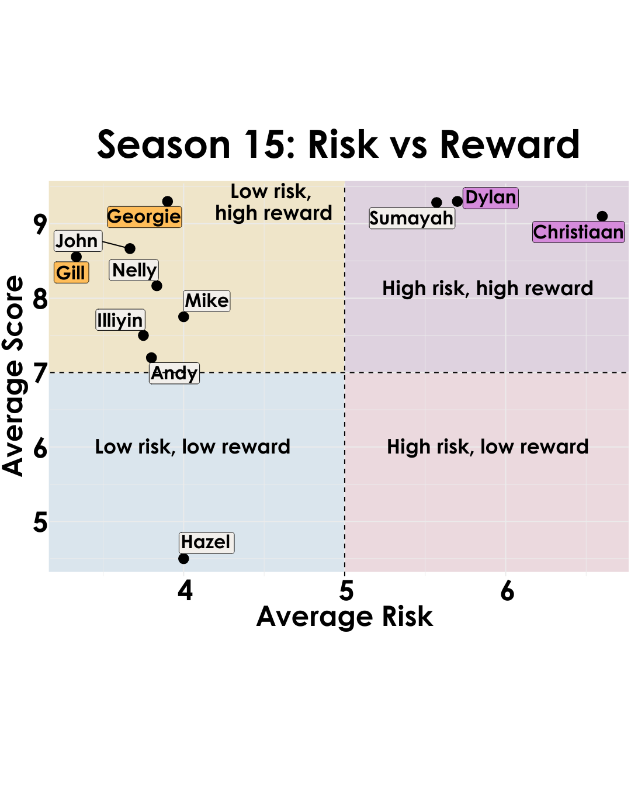

{.lightbox width="50%"}

## About
Did taking risks benefit the bakers over the whole season?  
Two of the three riskiest bakers made it to the finals, so it seems beneficial to take risks to stand out if you can pull it off.  Similarly, Gill got let go because she didn’t quite push the boundaries enough.  But it’s a fine line because Georgie who played it safer than Dylan and Christiaan won by using classic flavors.
As Prue said these flavors are classic, because they are the best.  
Takeaway, take some risks to stand out, but don’t go as far as putting licorice in your bakes.  
Average risk calculated as risk taken for all episodes baker participated in  
Average score calculated as score for all episodes baker participated in  
Scores above incorporate signature bake, technical ranking, showstopper bake and star baker status  

Final version of plot modified in adobe illustrator

**Data source:** GBBO S15

## Code

```{r}
#| eval: false
setwd("gbbo/code")

library(dplyr)
library(tidyr)
library(readxl)
library(ggplot2)
library(ggrepel)
library(data.table)
library(viridis)
library(shadowtext)
library(janitor)
library(pheatmap)

# Answering the question: Risk vs Reward

# parameters
my_theme <- theme(
  plot.title = element_text(),
        #text = element_text(size = 16),
        axis.title = element_text(face = "bold",size = rel(1)),
        axis.title.y = element_text(angle=90,vjust =2, size = 16),
        axis.title.x = element_text(vjust = -0.2, size = 16),
        axis.text = element_text(size = 16), 
        axis.line.x = element_line(colour="black"),
        axis.line.y = element_line(colour="black"),
        axis.ticks = element_line(),
        # panel.grid.major = element_line(colour="#f0f0f0"),
        # panel.grid.minor = element_blank(),
)


color_pal_10 <- c("#045275", "#067B8D", "#2EA39B", "#7CCBA2", "#D1D79E", "#F8BA8C", "#F0746E", "#E24C74", "#BC2F74", "#7C1D6F")

# Read in data
data <- read_excel("../data/gbbo_season15_bake_risk_v3.xlsx", col_names = TRUE)

# clean up column names
data <- janitor::clean_names(data)
names(data)

# remove bakers from weeks they didn't participate:
data <- data %>%
  filter(!is.na(sign_score))


## remove jeff
data <- data %>%
  filter(baker != "Jeff")

## For final week, use the "winner" as the star baker
data$star_baker[data$baker == 'Georgie Grasso' & data$week_number == 10] <- 1
data$star_baker[data$baker == 'Christiaan de Vries' & data$week_number == 10] <- 0
data$star_baker[data$baker == 'Dylan Bachelet' & data$week_number == 10] <- 0


# Calculate risk taken per baker per episode
data <- data %>%
  mutate(episode_risk = sign_risk + showstopper_flavor_risk + showstopper_design_risk)

# Calculate episode score per baker per episode

## get technical scores
data$technical_rank <- as.numeric(data$technical_rank)

data <- data %>%
  group_by(week_number) %>%
  mutate(
    tech_score = ntile(technical_rank, 4)
  )

data <- data %>%
  mutate(
    technical_score = case_when(
      tech_score == 1 ~ 3,
      tech_score == 2 ~ 2,
      tech_score == 3 ~ 1,
      tech_score == 4 ~ 0
    )
  )

# sanity check
check <- data %>% filter(week_number == 2)

# add star baker status
data$sb_score <- ifelse(data$star_baker == 1, 3, 0)


# total episode score
data$episode_score <- data$sign_score + data$showstopper_score + data$technical_score + data$sb_score


# calculate average scores per baker
data <- data %>%
  group_by(baker) %>%
  mutate(avg_risk = mean(episode_risk),
         avg_score = mean(episode_score))

avgs <- data %>% filter(week_number == 1)
avgs$baker_name <- gsub(" .*", "", avgs$baker)

# min_x <- 3
# max_x <- 10
# min_y <- 2
# max_y <- 14

risk_cutoff <- mean(c(3, 10))
score_cutoff <- mean(c(2, 14))

avgs <- avgs %>%
  mutate(status = case_when(
    baker_name == "Georgie" ~ "Winner",
    baker_name == "Dylan" ~ "Finalist",
    baker_name == "Christiaan" ~ "Finalist",
    baker_name == "Gill" ~ "Semi-Finalist",
    TRUE ~ "all"
  ))

avgs$status <- factor(avgs$status, levels = c("Winner", "Finalist", "Semi-Finalist", "all"))

ggplot(avgs,
       aes(x = avg_risk, y = avg_score, label = baker_name)) +
  geom_point(aes(fill = status), size = 4) +
  geom_label_repel(aes(fill = status), size = 6) +
  theme_classic() +
  theme(legend.position = "none") +
  xlab("Overall Average Risk") +
  ylab("Overall Average Score") +
  ggtitle(paste0("S15 Risk vs Reward")) +
  scale_fill_manual(values = c("orange", "#E24C74", "lightblue", "lightgray")) +
  scale_color_manual(values = c("orange", "#E24C74", "lightblue", "lightgray")) +
  # Add labels and customize axes
  geom_hline(yintercept = c(7), linetype = "dashed") +
  geom_vline(xintercept = c(5), linetype = "dashed") +
  my_theme +
  theme_minimal() +
  theme(legend.position = "none",
        axis.text = element_text(size = 20),
        axis.title = element_text(size = 20)) +
  theme(
    panel.background = element_rect(fill = "transparent", color = NA),  # Panel background
    plot.background = element_rect(fill = "transparent", color = NA)   # Overall plot background
  )
ggsave(paste0("../results/04-GBBO_Risk_vs_Reward_Overall_Season15.pdf"), bg='transparent', h = 6, w = 8)

```