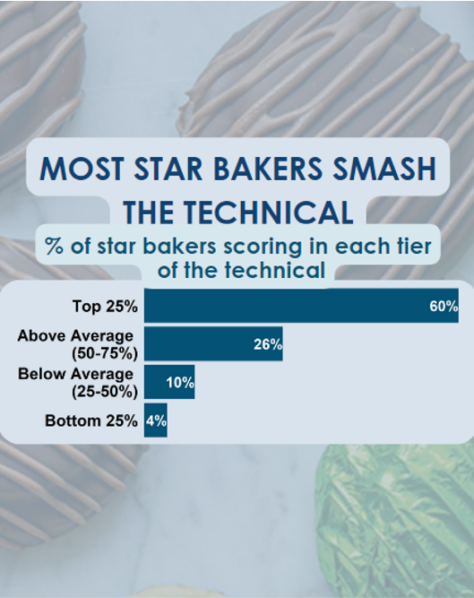

{.lightbox width="50%"}

## About

Here we're looking at how often a star baker ranks at the top or bottom of the technical challenge.  For most weeks, the star baker scores in the top 25% of the technical.  Over 13 seasons, the star baker has scored at the very bottom of the technical only 5 times.

**Data source:** GBBO Wikipedia

## Code

```{r}
#| eval: false
setwd("gbbo/code")

library(dplyr)
library(readxl)
library(ggplot2)
library(ggrepel)
library(data.table)
library(viridis)
library(shadowtext)
library(RColorBrewer)

# Answering the question: Does technical score matter?  How often do the star bakers come in the bottom 10 or 25% in the technical?

# parameters
my_theme <- theme(
  plot.title = element_text(),
        #text = element_text(size = 16),
        axis.title = element_text(face = "bold",size = rel(1)),
        axis.title.y = element_text(angle=90,vjust =2, size = 16),
        axis.title.x = element_text(vjust = -0.2, size = 16),
        axis.text = element_text(size = 16), 
        axis.line.x = element_line(colour="black"),
        axis.line.y = element_line(colour="black"),
        axis.ticks = element_line(),
        # panel.grid.major = element_line(colour="#f0f0f0"),
        # panel.grid.minor = element_blank(),
)


# Read in data
data <- read_excel("../data/GBBO_data.xlsx", skip = 1)

small <- data %>% select(Season, `Week Number`, Baker, `Technical Rank`, `Star Baker`, Eliminated)
names(small) <- c("season", "week", "baker", "tech", "sb", "elim")


# start at season 3
small <- small %>% filter(season != "Series 1")
small <- small %>% filter(season != "Series 2")


# calculate technical percentage per week
small <- small %>% filter(!is.na(tech))


# remove final week (only 3 bakers remaining)
small <- small %>% filter(week < 10)

small <- small %>%
  group_by(week) %>%
  mutate(
    Percentage = ((max(tech) - tech + 1) / max(tech)) * 100  # calculate so a low rank means a higher percentage
  ) %>%
  ungroup()


# create categories of tech rank
small <- small %>%
  mutate(tech_group = case_when(
    Percentage <= 25 ~ "bottom 25%",
    Percentage <= 50 & Percentage > 25 ~ "bottom 25-50%",
    Percentage <= 75 & Percentage > 50 ~ "top 50-75%",
    Percentage > 75 ~ "top 25%"
  ))


count <- small %>% filter(sb == 1) %>%
  count(tech_group) %>%
  mutate(percent = (n/sum(n)) * 100)


count$tech_group <- factor(count$tech_group, levels = c("bottom 25%", "bottom 25-50%", "top 50-75%", "top 25%"))


ggplot(count, aes(x = percent, y = tech_group)) +
  geom_col(fill = "#045275") +
  #scale_fill_manual(values = c("#045275")) +
  scale_y_discrete(
    #breaks = c(1, 2, 3, 4),  # Set breaks at the corresponding y-values
    labels = c("Bottom 25%", "Below Average \n (25-50%)", "Above Average \n (50-75%)", "Top 25%")
  ) +
  labs(y = "", x = "") +
  ggtitle("Most star bakers smash the technical", subtitle = "% of star bakers scoring in each tier of the technical") +
  geom_text(aes(label = paste0(round(percent), "%")), 
            hjust = 1,  # Slightly inside the bar
            color = "white",
            size = 7,        # Increases the text size
            fontface = "bold", # Makes the text bold
            position = position_dodge(width = 0.9)) +
  scale_x_continuous(expand = c(0, 0)) +
  theme_minimal() +
  theme(
      plot.title.position = "plot",
      plot.title = element_text(color = "black", face = "bold", hjust = 0, size = 18),  # Title alignment and color
      plot.subtitle = element_text(hjust = 0, color = "gray40", size = 16),  # Subtitle alignment and color
      #title = element_text(size = 18),
      axis.title.y = element_blank(),        
      panel.grid = element_blank(),          
      axis.ticks = element_blank(),          
      axis.text.x = element_blank(),         
      axis.text.y = element_text(color = "black", face = "bold", size = 22, margin = margin(r = 5)),
      legend.position = "none"
      ) 

ggsave('../results/06-SB-technical_scores.pdf', bg='transparent', h = 4, w = 8)
ggsave('../results/06-SB-technical_scores.png', bg='transparent', h = 4, w = 8.5)


small %>% filter(tech_group == "bottom 25%" & sb == 1)
# only happened 5 times total (2 in this season, episode 3 and 5)

```
