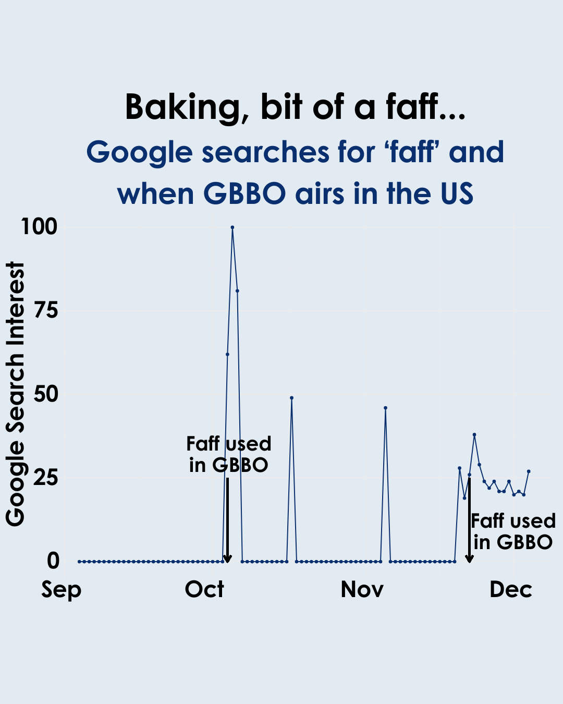

{.lightbox width="50%"}

## About

Faff search peaks after GBBO episodes

**Data source:** Google Trends

## Code

```{r}
#| eval: false
setwd("gbbo/code")

library(dplyr)
library(tidyr)
library(readxl)
library(ggplot2)
library(ggrepel)
library(data.table)
library(viridis)
library(shadowtext)
library(janitor)
library(pheatmap)


# Read in data
data <- read.csv("../data/google_trends/multiTimeline_faff.csv", skip = 1)
names(data) <- c("date", "faff")
data$group <- "A"
data$date <- as.Date(data$date, format = "%Y-%m-%d")

# faff episodes
faff_episodes <- c("10/4/2024", "11/22/2024")
faff_episodes <- as.Date(faff_episodes, format = "%m/%d/%Y")
faff_episodes

# episode arrows
e1_start <- as.Date("10/4/2024", format = "%m/%d/%Y")
e2_start <- as.Date("11/22/2024", format = "%m/%d/%Y")

ggplot(data, aes(x = date, y = faff, group = group)) +
  geom_point(color = "#092f6e", size = 1) +
  geom_line(color = "#092f6e") +
  theme(axis.text.x = element_text(angle = 90, hjust = 1)) +
  # geom_vline(xintercept = as.numeric(faff_episodes), linewidth = 1, linetype = "dashed", color = "#00a8a8") +
  geom_segment(aes(x = start, y = 25, xend = start, yend = 0),
               arrow = arrow(length = unit(0.1, "inches"), type = "open"),
               color = "black", size = 1) +
  geom_segment(aes(x = e2_start, y = 25, xend = e2_start, yend = 0),
               arrow = arrow(length = unit(0.1, "inches"), type = "open"),
               color = "black", size = 1) +
  xlab("") +
  ylab("Google Search Interest") +
  theme_minimal() +
  theme(axis.text = element_text(size = 20),
        axis.title = element_text(size = 20),
    panel.background = element_rect(fill = "transparent", color = NA),  # Panel background
    plot.background = element_rect(fill = "transparent", color = NA)   # Overall plot background
  )
ggsave("../results/google_search_terms_faff.pdf", bg='transparent', h = 6, w = 8)
```
