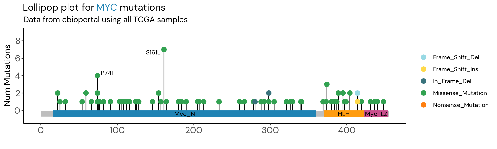

{.lightbox width="50%"}

## About

Lollipop plot for MYC mutations

**Data source:** Data from cbioportal using all TCGA samples

## Code

```{r}
#| eval: false
# Recreate lollipop plot in R

setwd("lollipop_plot/code")
library(tidyverse)
library(RColorBrewer)
library(ggthemes)
library(ggrepel)
library(ggtext)
library(showtext)
library(scales)


# Add cool fonts to use in plots
font_add_google("DM Sans", "DM")
my_font <- "DM"
showtext_auto()

# Read in mutations
mutations <- read_csv("../data-final/myc_mutations_cbioportal.csv")
mutations$aa_pos <- as.numeric(mutations$aa_pos)

domains <- data.frame(Domain = c("Myc_N", "HLH", "Myc-LZ"),
                      start = c(16, 370, 423),
                      end = c(360, 422, 454),
                      color = c("#1F83B4", "#FF9C0F", "#C94D8C")
                      )

mutations <- data.frame(aa_pos = mutations$aa_pos, # numeric (location)
                        label = mutations$protein_change, # label (text)
                        num_mutations = mutations$num_muts, # numeric
                        mut_type = mutations$mutation_type  # text
)

# Which mutations you want to label on the plot
mut_label <- mutations %>%
  filter(label %in% c("S161L", "P74L"))

# Coordinates of the gene (AA to show on plot)                        
gene_start <- 0
gene_end <- 455


# Parameters for plot based on input data
mutation_palette <- tableau_color_pal("Classic Green-Orange 12")(12)
show_col(mutation_palette)
# Shuffle colors randomly
# mutation_palette <- sample(mutation_palette)
mutation_palette <- c("#98d9e4", "#ffd94a", "#39737c", "#32a251", "#ff7f0f")

domain_palette <- tableau_color_pal("Classic Cyclic")(13)
# shuffle colors
domain_palette <- sample(domain_palette)

## max height of plot 
max_muts <- max(mutations$num_mutations) + 2

## fill in any missing domain colors
for (i in seq_along(domains$color)) { 
if (is.na(domains$color[i])){
  domains$color[i] <- color_pal[i]
}
}


# Generate lollipop plot

title <- "Lollipop plot for <span style='color:#1F83B4;'>MYC</span> mutations"
subtitle <- "Data from cbioportal using all TCGA samples"


ggplot() +
  # gene track
  geom_rect(aes(xmin = gene_start, xmax = gene_end, ymin = -0.7, ymax = -0.1), fill = "gray") +

  # extend Y axis based on max mutations
  scale_y_continuous(limits = c(-1, max_muts), breaks = c(seq(0, max_muts, 2))) +

# add specific mutations
  geom_segment(data = mutations, aes(x = aa_pos, y = -0.1, xend = aa_pos, yend = num_mutations)) +
  geom_point(data = mutations, aes(x = aa_pos, y = num_mutations, color = mut_type), size = 3) +
  scale_color_manual(values = mutation_palette) +

  # add mutation labels
  geom_text_repel(data = mut_label, aes(x = aa_pos, y = num_mutations, label = label), size = 10, family = my_font) +
  
  # Add gene domains (add after segments to plot over line beginning at 0)
  geom_rect(data = domains, aes(xmin = start, xmax = end, ymin = -0.75, ymax = 0, fill = color)) +
  scale_fill_identity() +  # Uses the colors specified in the domain dataframe
  
  # Add labels to domains
  geom_text(data = domains, aes(x = (start + (end-start)/2), y = -0.375, label = Domain),
            size = 10, family = my_font) +
  
  # Format plot
  labs(title = title,
       subtitle = subtitle,
       x = "",
       y = "Num Mutations",
       color = "")+
  theme_classic() +
  theme(plot.title = element_markdown(size = 44),
        plot.subtitle = element_text(size = 36),
        text = element_text(size = 34, family = my_font),
        axis.title = element_text(size = 40),
        axis.text = element_text(size = 40),
        legend.position = "right")

ggsave("../results/MYC_TCGA_Lollipop_plot.png", w = 10, h = 3)
```
