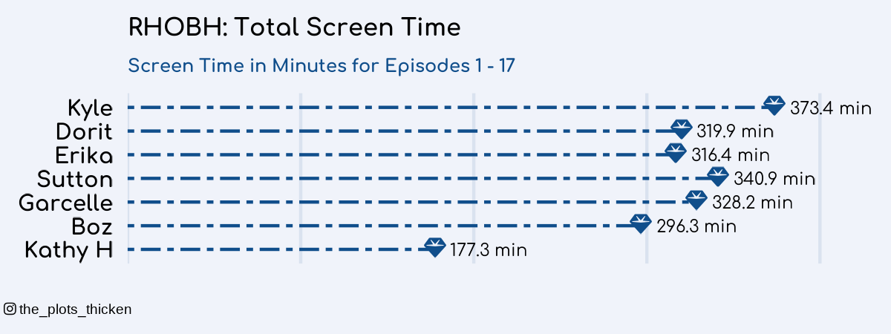

{.lightbox width="50%"}

## About

Screen times shown are the number of minutes each cast member was featured in episodes 1-17.  If multiple cast members are in a scene together, the minutes of that scene go towards everyone's total time.

**Data source:** Collected while watching RHOBH

## Code

```{r}
#| eval: false
setwd("RHOBH/code")

# Load necessary libraries
library(ggplot2)
library(dplyr)
library(readr)
library(tidyr)
library(readxl)
library(ggpubr)
library(showtext)
library(ggtext)
library(grid)


# Add cool fonts to use in plots
# font_add_google(google name, font name in R)
font_add_google("Quicksand", "quicksand")
font_add_google("Comfortaa", "comfortaa")
font1 <- "quicksand"
font2 <- "comfortaa"
showtext_auto()

# Import font awesome to use icons
# font_add(name in R, path to .otf-file) - downloaded from Font Awesome
font_add('fa-reg', '../../fontawesome/otfs/Font Awesome 6 Free-Regular-400.otf')
font_add('fa-brands', '../../fontawesome/otfs/Font Awesome 6 Brands-Regular-400.otf')
font_add('fa-solid', '../../fontawesome/otfs/Font Awesome 6 Free-Solid-900.otf')

# Get all files with screentimes
file_path <- "../data-raw/"  # Update this with the actual file path
files <- list.files(file_path, pattern = "screentime_s14_.*\\.xlsx", full.names = TRUE)

# number of episodes
n_episodes <- length(files)


# Function to read and process each file
process_file <- function(file) {
  df <- read_excel(file)
  episode_num <- gsub("screentime_s14_e", "", basename(file))  # Extract episode number
  episode_num <- gsub("\\.xlsx", "", episode_num)  # Extract episode number
  
  # get rows needed
  df <- df[1:7, 1:3]
  
  df$Minutes <- as.numeric(df$Minutes)
  df$Seconds <- as.numeric(df$Seconds)
  
  # Make NAs = 0
  df$Minutes[is.na(df$Minutes)] <- 0
  df$Seconds[is.na(df$Seconds)] <- 0
  
  
  df <- df %>%
    mutate(
      Total_Seconds = Minutes * 60 + Seconds,
      Total_Min = Total_Seconds/60,
      Episode = paste0("Episode ", episode_num)
    ) %>%
    select(Character = 1, Episode, Total_Min)  # Assuming character names are in the first column
  
  # Convert NA to 0
  # df$Total_Min[is.na(df$Total_Min)] <- 0
  
  return(df)
}

# Read and combine all episodes
all_data <- bind_rows(lapply(files, process_file))

# Summarize total screentime per character
summary_data <- all_data %>%
  group_by(Character, Episode) %>%
  summarize(Total_Min = sum(Total_Min), .groups = "drop")

# Sort characters by total screentime
total_screentime <- summary_data %>%
  group_by(Character) %>%
  summarize(Total_time = sum(Total_Min)) %>%
  arrange(Total_time)

# Merge total screentime back into summary_data for labeling
summary_data <- left_join(summary_data, total_screentime, by = "Character")

# Order factor levels
summary_data$Character <- factor(summary_data$Character, levels = total_screentime$Character)

# Order episode
epi_order <- paste0("Episode ", 1:n_episodes)
summary_data$Episode <- factor(summary_data$Episode, levels = rev(epi_order))

# ** Plot with diamonds **

# order women by total screentime
order <- total_screentime %>% arrange(Total_time) %>% pull(Character)

total_screentime$Character <- factor(total_screentime$Character, levels = order)

title = paste0("RHOBH: Total Screen Time")
subtitle = paste0("Screen Time in Minutes for Episodes 1 - ", n_episodes)
caption = "<span style='font-family:fa-brands;'>&#xf16d;</span> the_plots_thicken"


ggplot(total_screentime, aes(x = Total_time, y = Character)) +
  # Draw segment lines
  geom_segment(aes(x = 0, y = Character, xend = Total_time, yend = Character), 
               linewidth = .5, linetype = "twodash", color = "dodgerblue4") +
  
  # Add Font Awesome icons using geom_richtext
  geom_richtext(aes(label = "<span style='font-family:fa-solid;'>&#xf3a5;</span>"), 
                size = 8, label.colour = NA, fill = NA, color = 'dodgerblue4') +
  
  # Add total time text at the end of each bar
  geom_text(aes(x = Total_time, label = paste0(round(Total_time, 1), " min")), 
            hjust = -0.2, size = 6, family = font2) +  # `hjust = -0.1` places text outside the bars
  
  # Remove left gap by adjusting expand
  scale_x_continuous(expand = expansion(mult = c(0, 0.15))) +
  scale_y_discrete(expand = expansion(mult = c(0.1, 0.1))) +

  
  # Labels and title
  labs(title = title,
       subtitle = subtitle,
       x = NULL,  # Remove axis label for a cleaner look
       y = NULL,
       caption = caption,
       fill = NULL) +  # Remove legend title for simplicity 
  
  # Theme modifications for a clean, professional look
  theme_minimal(base_family = "sans") +
  theme(
    panel.grid.major.y = element_blank(),  # Remove horizontal gridlines
    panel.grid.minor = element_blank(),  # Remove minor gridlines
    panel.border = element_blank(),  # Remove panel border
    axis.text = element_text(size = 22, color = "black", face = "bold", family = font2),  # Increase axis text size
    axis.text.x = element_blank(),
    axis.title.y = element_text(size = 14, margin = margin(r = 10)),  
    axis.title.x = element_text(size = 14, margin = margin(t = 10)),  
    plot.title = element_text(size = 24, face = "bold", hjust = 0, family = font2),  # Centered title
    plot.subtitle = element_text(size = 18, face = "bold", hjust = 0, family = font2, color = "dodgerblue4"),
    legend.position = "none",  # Move legend to the top
    legend.text = element_text(size = 12),
    plot.caption = element_markdown(hjust=-0.2, margin=margin(10,0,0,0), size=14, color="black", lineheight = 1.2),
    panel.grid = element_line(color = alpha("dodgerblue4", 0.1)),

    # Set background color
    plot.background = element_rect(fill = "#F0F3FA", color = NA),  
    panel.background = element_rect(fill = "#F0F3FA", color = NA)  
  )


filename <- paste0("../results/total_screentime_ep1_", n_episodes, ".png")
ggsave(filename, w = 4, h = 1.5)


```
