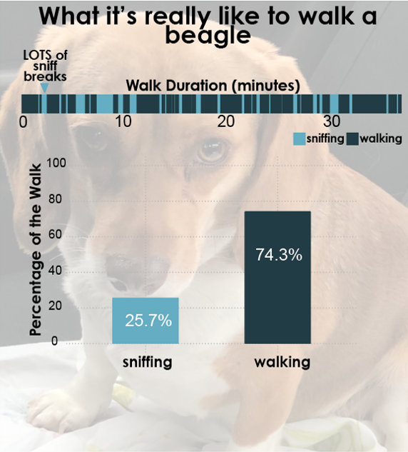

{.lightbox width="50%"}

## About

Walking a beagle is 75% walking and 25% standing still while your beagle sniffs...on a good day

**Data source:** Garmin watch

## Code

```{r}
#| eval: false
library(ggplot2)
library(dplyr)
library(lubridate)
library(data.table)
library(gganimate)
library(av)
library(cowplot)

setwd("walking_data/code")

# read in data
data <- read.csv("../data/09_22_24.csv")
data$Start <- format(data$Start, nsmall = 2)
data$Stop <- format(data$Stop, nsmall = 2)

# Get distance covered
distance <- as.numeric(data$Distance_Miles[1])

# Get total time walked in each segement by combining minutes and seconds
data$start_minutes <- as.numeric(gsub("\\..*", "", data$Start))
data$start_seconds <- as.numeric(gsub(".*\\.", "", data$Start))
data$start_total <- (data$start_minutes*60) + data$start_seconds
data$start_total <- data$start_total/60 # convert back to minutes

data$stop_minutes <- as.numeric(gsub("\\..*", "", data$Stop))
data$stop_seconds <- as.numeric(gsub(".*\\.", "", data$Stop))
data$stop_total <- (data$stop_minutes*60) + data$stop_seconds
data$stop_total <- data$stop_total/60

# note these are all the walking segments
data$activity <- "walking"

# get columns needed for plotting
small <- data %>% select(start_total, stop_total, activity)

# add in sniff breaks
sniffing <- data.frame(start_total = rep(0, times = nrow(data)-1), stop_total = 0, activity = "sniffing")

for (i in 2:(nrow(data))){
  # print(i)
  sniffing$start_total[i-1] <- data$stop_total[i-1] + .0001 # sniff break starts at last walking endpoint
  sniffing$stop_total[i-1] <- data$start_total[i]-.0001 # sniff breaks ends at next walking start point
}

# join together the walking and sniffing portions
all <- rbind(small, sniffing)

# arrange by start time (alternate walking/sniffing breaks)
all <- all %>% arrange(start_total)

# For segmentation, put all at "0" (one horizontal line)
# all$activity_score <- ifelse(all$activity == "walking", 1, 0)
all$activity_score <- 0

# Get percentage of time spent walking vs sniffing
all$duration <- all$stop_total - all$start_total
df_summary <- all %>%
  group_by(activity) %>%
  summarise(time = sum(duration)) %>%  # Sum time per activity
  mutate(percentage = (time / sum(time) * 100)) %>% # Calculate percentage
  mutate(display = paste0(round(percentage, 1), "%"))


# Generate plots

## old version
# ggplot(all, aes(x = start_total, xend = stop_total, y = activity_score, yend = activity_score, color = activity)) +
#   geom_segment(size = 1.5) +  # Use geom_segment for horizontal lines
#   scale_y_continuous(breaks = c(0, 1)) +  # Only show breaks for 0 and 1 on y-axis
#   labs(x = "Time (seconds)", y = "State") +
#   theme_minimal()

custom_theme <- theme(
      plot.title = element_text(hjust = 0.5, size = 16, face = "bold"),  # Centered title
      plot.subtitle = element_text(hjust = 0.5, size = 14),  # Centered subtitle
      axis.title = element_text(size = 14),  # Axis titles
      axis.text = element_text(size = 12),  # Axis text
      # legend.position = "top",  # Place the legend at the top
      legend.title = element_text(size = 12),
      legend.text = element_text(size = 12),
      panel.grid.major = element_line(size = 0.5, linetype = "dotted", color = "grey"),  # Major grid lines
      panel.grid.minor = element_blank(),  # No minor grid lines
      plot.margin = margin(10, 10, 10, 10)  # Adjust margins
    )


# Segmentation plot of walking & sniffing portions
walk_plot <- ggplot(all, aes(x = start_total, xend = stop_total, y = activity_score, yend = activity_score, color = activity)) +
  geom_segment(size = 15) +  # Use geom_segment for horizontal lines
  scale_x_continuous(expand = expansion(mult = c(0, 0))) + 
  scale_y_discrete(expand = expand_scale(mult = c(0.1, 1))) +  # Only show breaks for 0 and 1 on y-axis
  labs(x = "", y = "") +
  scale_color_manual(values = c("#65ADC2", "#233B43")) +
  ggtitle("Walk Duration (minutes)") +
  theme_minimal(base_size = 14) +
  custom_theme +
  theme(legend.position = "none",
        plot.margin = unit(c(0.1, 0.5, 0, 0), "cm")) # L,R, 
  # theme(
  #   axis.title.y = element_blank(),    # Remove y-axis title
  #   axis.text.y = element_blank(),     # Remove y-axis text (labels)
  #   axis.ticks.y = element_blank(),    # Remove y-axis tick marks
  #   panel.grid.major.y = element_blank(), # Remove major y gridlines
  #   panel.grid.minor.y = element_blank(), # Remove minor y gridlines
  #   legend.position = "none",
  #   text = element_text(size = 16),
  #   plot.title = element_text(hjust = 0.5)
  # )

# bar plot of percentage of time walking vs sniffing
col_plot <- ggplot(df_summary, aes(x = activity, y = percentage, fill = activity)) +
  geom_col(width = 0.5) +
  scale_fill_manual(values = c("#65ADC2", "#233B43")) +
  geom_text(aes(label = display), vjust = 1.5, color = "white", fontface = "bold") +
  scale_y_continuous(limits = c(0, 100), breaks = seq(0, 100, by = 20)) +
  xlab("") +
  ylab("Percentage of the Walk") +
  theme_minimal() +
  custom_theme +
  theme(legend.position = "bottom",
        plot.margin = unit(c(0.1, 0.5, 0, 0), "cm"))
  # theme(
  #   text = element_text(size = 16),
  #   #panel.grid.major.y = element_blank(), # Remove major y gridlines
  #   panel.grid.minor.y = element_blank(),  # Remove minor y gridlines
  #   legend.position = "bottom"
  # )

# Combine the two plots
combined_plot <- plot_grid(walk_plot, col_plot, ncol = 1, rel_heights = c(1, 2.5))
combined_plot

ggsave("../results/09_22_24_sammy_walk.pdf", width = 10.8, height = 10.8, dpi = 300, bg = "transparent")
```
