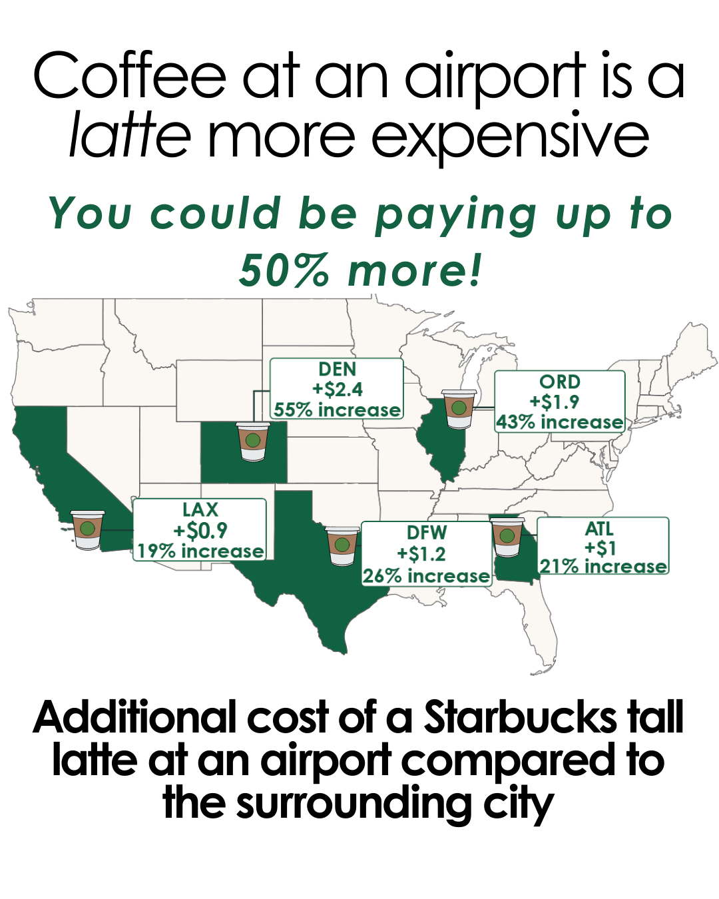
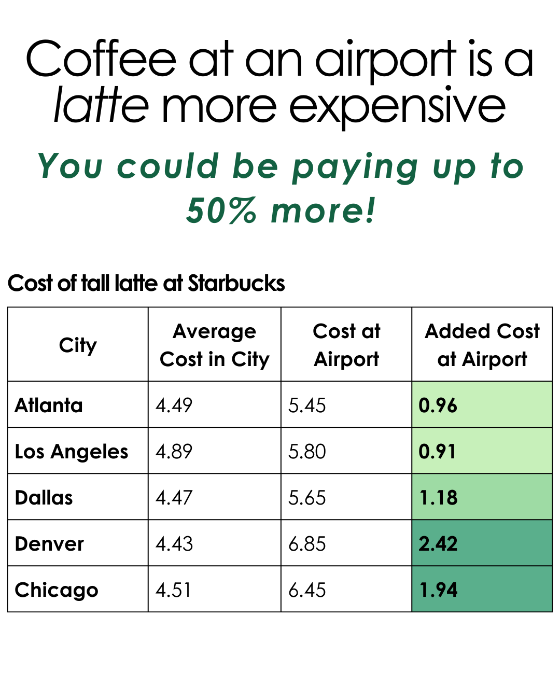

{.lightbox width="50%"}
{.lightbox width="50%"}


## About

A tall latte at an airport can be up to 50% more expensive compared to the prices in the surrounding city.  Comparison was done for the top 5 busiest US airports.  Average cost per city was calculated using prices for 5 randomly chosen stores.

**Data source:** Starbucks app

## Code

```{r}
#| eval: false
# Goal: plot the increase in latte prices at airports compared to the surrounding city on a US map

# Load libraries:
library(tidyverse)
library(sf)
library(ggmap)
library(ggplot2)
library(tidygeocoder)
library(choroplethr)
library(choroplethrMaps)
library(readxl)
library(ggrepel)

# Set working directory
setwd("airport_prices/code")

# Read in data
data <- read_excel("../data/sbux_prices.xlsx")

# subset to columns 1 - 6
data <- data[, c(1:7)]

# clean up names
names(data) <- c("city", "airport_code", "terminal", "address", "airport", "tall_coffee", "tall_latte")

# Only keep 5 busiest airports
keep <- c("ATL", "LAX", "DFW", "DEN", "ORD")
data <- data %>%
  filter(airport_code %in% keep)

# get stats for non-airport locations
non_airport <- data %>%
  filter(airport == "no")

# get mean and median price for tall coffee and tall latte by city
summary <- non_airport %>%
  group_by(city) %>%
  summarize(mean_coffee = mean(tall_coffee),
            mean_latte = mean(tall_latte),
            med_coffee = median(tall_coffee),
            med_latte = median(tall_latte))

# add in airport prices
summary2 <- data %>%
  filter(airport == "yes") %>%
  left_join(summary, by = c("city"))

# calc percent change at airport
percent_change_coffee <- as.data.frame(lapply(summary2[, c(8,10)], function(x) ((summary2$tall_coffee - x)/x * 100)))
percent_change_coffee$city <- summary2$city
names(percent_change_coffee) <- c("pc_mean_coffee", "pc_med_coffee", "city")

percent_change_latte <- as.data.frame(lapply(summary2[, c(9, 11)], function(x) ((summary2$tall_latte - x)/x * 100)))
percent_change_latte$city <- summary2$city
names(percent_change_latte) <- c("pc_mean_latte", "pc_med_latte", "city")

# combine back together
summary2 <- summary2 %>%
  left_join(percent_change_coffee, by = c("city")) %>%
  left_join(percent_change_latte, by = c("city"))

# subset to latte data
latte <- summary2 %>%
  select(city, airport_code, tall_latte, mean_latte, med_latte, pc_mean_latte, pc_med_latte)

latte$pc_med_latte <- round(latte$pc_med_latte, 2)

# add state to latte data for merging in next section
latte <- latte %>%
  mutate(region = case_when(
    city == "Atlanta" ~ "georgia",
    city == "Los Angeles" ~ "california",
    city == "Dallas" ~ "texas",
    city == "Denver" ~ "colorado",
    city == "Chicago" ~ "illinois"
  ))

## add labels for plot
latte$diff <- round(latte$tall_latte - latte$mean_latte, 1)
latte$label <- paste0(latte$airport_code, "\n",
                      "+$", latte$diff, "\n", 
                      round(latte$pc_mean_latte, 2), "% increase")


# Plot change
### # Get coordinates for airport adddresses
airports <- data %>%
  filter(airport == "yes")

airports <- airports %>%
  tidygeocoder::geocode(address)

# couldn't find ATL, add in manually
airports$lat[airports$airport_code == "ATL"] <- 33.640320
airports$long[airports$airport_code == "ATL"] <- -84.439697

airports <- airports %>%
  select(airport_code, lat, long)

latte <- left_join(latte, airports, by = c("airport_code"))


## Background US map

us <- read_sf("../data/US-State-coordinates/cb_2018_us_state_20m.shp")

# Transform coordinates so we can match with the long and lat
us2 <- st_transform(us, crs = 4326)  # EPSG:4326 - WGS84, which uses longitude and latitude

# remove Hawaii, Alaska and Puerto Rico
us2 <- us2 %>%
  filter(!NAME %in% c("Hawaii", "Alaska", "Puerto Rico"))

keep <- c("Georgia", "California", "Texas", "Colorado", "Illinois")


ggplot() +
  geom_sf(data = us2, fill = "#EFE1D1", alpha = 0.3) +
  geom_sf(data = subset(us2, NAME %in% keep), fill = "#006241") +
  geom_point(data = latte, aes(x = long, y = lat), color = "#1E3932") +
  geom_label_repel(data = latte,
                   aes(x = long, y = lat, label = label), 
             size = 3,
             min.segment.length = 0.5,
             label.padding = unit(0.2, "lines"), 
             color = "#006241") +
  theme_void()

ggsave("../results/sbux_airport_prices_map_v1.png", h = 5, w = 7)
ggsave("../results/sbux_airport_prices_map_v1.pdf", h = 5, w = 7)


# Write out table
df <- latte %>% select(city, airport_code, tall_latte, mean_latte)
write.csv(df, "../data/latte_price_comparison_summary_table.csv", row.names = FALSE)
```
