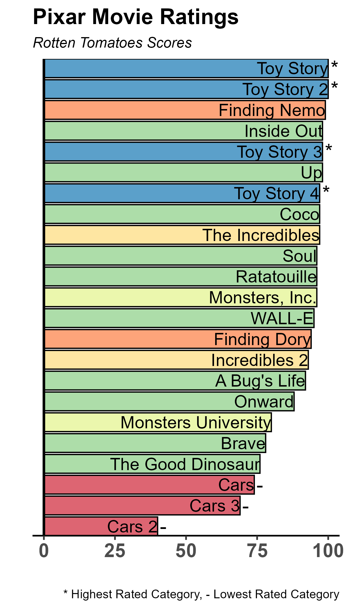

{.lightbox width="50%"}

## About

Plot compares Pixar movies by their Rotten Tomatoes Scores.  Toy Story and Toy Story 2 got a perfect 100!

**Data source:** TidyTuesday github repo

## Code

```{r}
#| eval: false
setwd("TidyTuesday/2025/Week10/code")

library(tidyverse)
library(RColorBrewer)
library(ggplot2)
library(ggpubr)
library(ggsci)


# ggplot theme
# col_palette <- c( "#95cf92", "#369acc", "#f8e16f", "#9656a2",  "#f4895f","#de324c")
# col_palette <- c( "#ffa602", "#ff6362", "#bc5090", "#58508d",  "#50868d","beige")


# Read in data
pixar_films <- readr::read_csv('https://raw.githubusercontent.com/rfordatascience/tidytuesday/main/data/2025/2025-03-11/pixar_films.csv')
public_response <- readr::read_csv('https://raw.githubusercontent.com/rfordatascience/tidytuesday/main/data/2025/2025-03-11/public_response.csv')


# merge data
## check for films missing between datasets
pixar_films$film[!pixar_films$film %in% public_response$film]

join <- pixar_films %>%
  inner_join(public_response, by = c("film"))

# Remove films without rotten tomatoes score
join <- join %>% filter(!is.na(rotten_tomatoes))

# Order films by rotten tomatoes score
order <- join %>%
  arrange(rotten_tomatoes) %>%
  pull(film)

# Swap Toy Story and Toy Story 2
order <- order[!order == "Toy Story"]
order <- c(order, "Toy Story")

join$film <- factor(join$film, levels = order)


# Create movie categories
join <- join %>%
  mutate(movie_categories = case_when(
    grepl("Toy", film) ~ "Toy Story",
    grepl("Monster", film) ~ "Monsters",
    grepl("Finding", film) ~ "Finding Nemo",
    grepl("Incredible", film) ~ "Incredibles",
    grepl("Cars", film) ~ "Cars",
    TRUE ~ "Other"
  ))


# Plot movies by rotten tomatoes scores
ggplot(join, aes(x = rotten_tomatoes, y = film, fill = movie_categories)) +
  geom_col(color = "black", alpha = 0.8) +
  #scale_fill_brewer(palette = "Pastel1") +
  scale_fill_brewer(palette = "Spectral") +
  
  # Remove space between bars and axes
  scale_x_continuous(expand = c(0, 4)) +
  scale_y_discrete(expand = c(0, 0)) +
  geom_text(aes(label = film, hjust = "right"), color = "black", size = 5, face = "bold") +
  
  # Add asterisks for Toy Story movies
  geom_text(aes(label = ifelse(movie_categories == "Toy Story", "*", "")), 
            hjust = -0.3, size = 6, color = "black", face = "bold") +
  # Add - for Cars movies
  geom_text(aes(label = ifelse(movie_categories == "Cars", "-", "")), 
            hjust = -0.3, size = 6, color = "black") +
  labs(
    x = "",
    y = "",
    title = "Pixar Movie Ratings",
    subtitle = "Rotten Tomatoes Scores",
    caption = "* Highest Rated Category, - Lowest Rated Category"
  ) +
  theme_classic(base_size = 14) +
  theme(
    axis.text.x = element_text(size = 16, face = "bold"),
    axis.line.y = element_blank(),
    axis.text.y = element_blank(),
    axis.ticks.y = element_blank(),
    plot.title = element_text(face = "bold", size = 18),
    plot.subtitle = element_text(face = "italic", size = 12),
    plot.caption = element_text(size = 10),
    legend.position = "none"
  ) +
  geom_vline(xintercept = 0, size = 1)

ggsave("../results/Rotten_Tomatoes_Pixar_Ratings.png", h = 7, w = 4, bg = "white")
```
