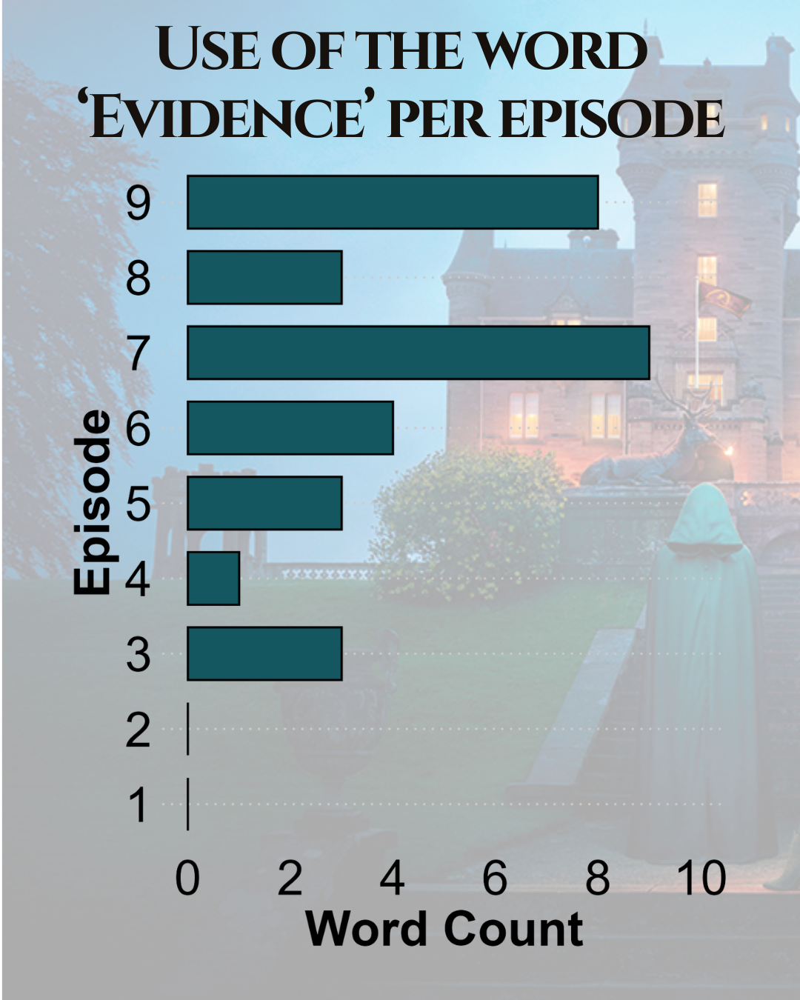

{.lightbox width="50%"}

## About

Rate of use = number of times a player says evidence divded by the total episodes the player was in  
Plots were finalized in canva

**Data source:** Collected while watching Traitors

## Code

```{r}
#| eval: false
setwd("Traitors/code")

library(ggplot2)
library(ggtext)
library(dplyr)
library(readr)
library(tidyverse)
library(readxl)

file_path <- "../data-final/evidence_usage_per_episode.xlsx"
data <- read_excel(file_path)


# remove false positives
data <- data %>% filter(is.na(`False Positive`))

# transform df for plotting
plot <- data %>%
  select(Episode, Evid_Num, Proof_Num, Fact_Num, Player) %>%
  pivot_longer(-c(Episode, Player))

plot$Word <- ifelse(plot$name == "Evid_Num", "Evidence", ifelse(plot$name == "Proof_Num", "Proof", "Fact"))

plot <- plot %>%
  group_by(Episode, Word, Player) %>%
  summarize(total = sum(value))

unique(plot$Episode)

# add in episode 1 with 0 counts for all 3 words

plot <- rbind(plot, (new_df = data.frame(Episode = c("e1", "e1", "e1"),
                                         Word = c("Evidence", "Fact", "Proof"),
                                         Player = c("", "", ""),
                                         total = c(0, 0, 0))))

plot$Episode_Num <- gsub("e", "", plot$Episode)


# check all words are used at least 1x
plot %>%
  group_by(Word) %>%
  summarize(total = sum(total))

# Remove Proof, never used
plot <- plot %>%
  filter(Word != "Proof")


# Add in episodes where they correctly banished a traitor
banish <- data.frame(episodes = paste0("e", 1:9), banish_correct = "N")
banish$banish_correct[banish$episodes %in% c("e4", "e7", "e9")] <- "Y"


plot <- full_join(plot, banish, by = c("Episode" = "episodes"))

# plot1 <- plot %>%
#   filter(Word == "Evidence")

plot1 <- plot %>%
  filter(Word == "Evidence") %>%
  group_by(Episode_Num) %>%
  summarize(total = sum(total))


#Plot by word usage
# Color by word
ggplot(plot1, aes(x = Episode_Num, y = total)) +
  geom_bar(stat = "identity", width = 0.7, color = "black", fill = "#145760") +  # Adds contrast
  # scale_fill_manual(values = c("#0073C2", "#56B4E9", "#E69F00", "#F0E442")) +  # Vibrant colors
  #scale_fill_manual(values = c("#145760")) +  # Vibrant colors
  
  # flip so barplot is horizontal
  coord_flip() +
  
  # Improve readability
  labs(#title = "Use of the word <b style='color:#145760'>'Evidence'</b> per Episode",
       # subtitle = "Stacked bar chart of word frequency by episode",
       x = "Episode",
       y = "Word Count",
       fill = "Word") +
  
  scale_y_continuous(limits = c(0, 10), breaks = seq(0, 10, by = 2)) +

  
  # Make fonts bigger and remove clutter
  theme_minimal(base_family = "sans") +
  theme(
    plot.title = element_markdown(size = 24, face = "bold", hjust = 0.5),  # Center title
    plot.subtitle = element_text(size = 24, hjust = 0.5, color = "gray40"),
    axis.text = element_text(size = 24, color = "black"),
    axis.title = element_text(size = 24, face = "bold", color = "black"),
    legend.position = "none",
    legend.text = element_text(size = 12),
    panel.grid.major.x = element_blank(),  # Remove vertical gridlines
    panel.grid.major.y = element_line(color = "gray80", linetype = "dotted"),
    panel.grid.minor = element_blank(),
    plot.margin = margin(20, 20, 20, 20)  # Add space around plot
  )
ggsave("../results/evidence_usage_per_episode.png", h = 6, w = 5)

total_evidence <- sum(plot1$total)

episodes_alive <- data.frame(Player = c("Bob TDQ", "Britney", "Carolyn", "Derek", "Dylan", "Gabby", "Sam", "Tom", "Wes"), 
                             Episodes_in = c(4, 9, 9, 5, 9, 9, 8, 9, 5))

total_player <- plot1 %>%
  group_by(Player) %>%
  summarize(sum = sum(total)) %>%
  filter(sum > 0) %>%
  mutate(percentage = sum/total_evidence*100) %>%
  left_join(episodes_alive) %>%
  mutate(episode_rate = sum/Episodes_in)
  

ggplot(total_player, aes(x= reorder(Player, episode_rate), y = episode_rate)) +
  geom_col(color = "white", fill = "#6c191d", width = 0.7) +
  # Improve readability
  labs(#title = "Sandoval says the word 'Evidence' most",
       # subtitle = "Stacked bar chart of word frequency by episode",
       x = "",
       y = "Rate of use") +
  
  # Make fonts bigger and remove clutter
  theme_minimal(base_family = "sans") +
  theme(
    plot.title = element_markdown(size = 20, face = "bold", hjust = 0.5),  # Center title
    plot.subtitle = element_text(size = 20, hjust = 0.5, color = "gray40"),
    axis.text = element_text(size = 20, color = "white"),
    axis.text.x = element_text(angle = 45, hjust = 1, vjust = 1.2, face = "bold"),
    axis.title = element_text(size = 20, face = "bold", color = "white"),
    legend.position = "none",
    legend.text = element_text(size = 12),
    panel.grid.major.x = element_blank(),  # Remove vertical gridlines
    panel.grid.major.y = element_line(color = "gray80", linetype = "dotted"),
    panel.grid.minor = element_blank(),
    plot.margin = margin(20, 20, 20, 20)  # Add space around plot
  )
  
ggsave("../results/evidence_usage_by_player_e1_e9.png", h = 5, w = 7)


```
