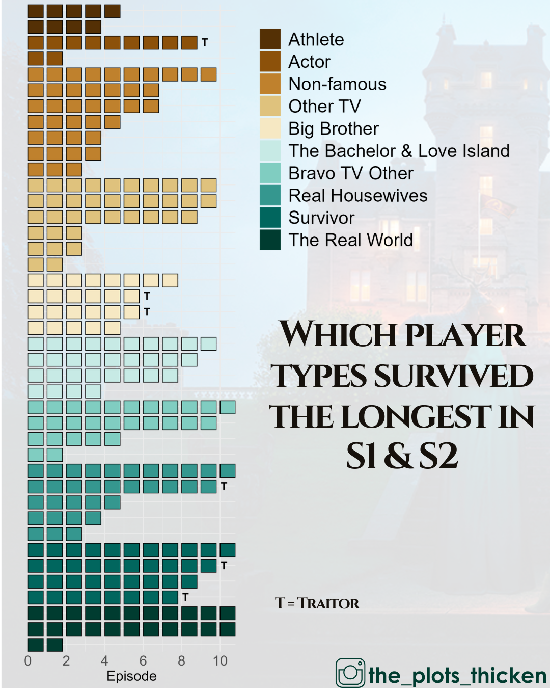

{.lightbox width="50%"}

## About

In season 1 and 2, while most categories had a mix of early exits and strong performances, the athletes struggled the most.  In contrast, every Survivor player lasted at least 8 episodes.  
Plots were finalized in canva

**Data source:** Manual data collection

## Code

```{r}
#| eval: false
setwd("Traitors/code")

library(tidyverse)
library(RColorBrewer)
library(readxl)
library(janitor)
library(ggbrick)
library(ggpubr)
library(patchwork)


# Read in data
data <- read_excel("../data-raw/players.xlsx")

# clean up name
data <- clean_names(data)

# add starting episode
data$start <- 1

# Fix "Real World" categories
data$category <- ifelse(grepl("Real World", data$category), "The Real World", data$category)

# combine bachelor/love island
data$category <- ifelse(grepl("Bachelor", data$category), "The Bachelor & Love Island", data$category)
data$category <- ifelse(grepl("Love Island", data$category), "The Bachelor & Love Island", data$category)

# rename other to other TV
data$category <- gsub("^Other", "Other TV", data$category)

# Filter data to only include season 1 and 2
data <- data %>% filter(season == 1 | season == 2)

# order the player categories
order_levels <- c("The Real World", "Survivor", "Real Housewives",
                  "Bravo TV Other", "The Bachelor & Love Island", "Big Brother",
                  "Other TV", "Non-famous", "Actor", "Athlete")

data$category[!data$category %in% order_levels]

# Order the players by their category and progression
data <- data %>%
mutate(category2 = factor(category, levels = order_levels)) %>% 
  arrange(category2, progression) %>%  # Sort first by category, then by progression
  mutate(name_short = factor(name_short, levels = unique(name_short))) 

# Create color palette for plot - Teal/Br from RColorBrewer
color_pal <- rev(RColorBrewer::brewer.pal(10, "BrBG"))

# Create a named vector for mapping colors to the categories
category_colors <- setNames(color_pal, order_levels)

# Waffle plot
        
# Create reversed data to get legend in the right order for the plot
levels2 <- rev(order_levels)
data2 <- data %>%
  mutate(category2 = factor(category, levels = levels2)) %>%  # Apply custom category order
  arrange(category2, progression) %>%  # Sort first by category, then by progression
  mutate(name_short = factor(name_short, levels = unique(name_short)))  # Maintain sorted order

# Create plot to extract legend
legend_plot <- ggplot(data2, aes(x = player_name, y = progression, fill = category2)) +
  geom_col() +
  scale_fill_manual(values = rev(color_pal)) +
  theme(legend.text = element_text(size = 14),
        legend.title = element_blank(),
    plot.background = element_rect(fill = "transparent", color = NA),  # Transparent background
    panel.background = element_rect(fill = "transparent", color = NA), # Transparent panel
    legend.background = element_rect(fill = "transparent", color = NA), # Transparent legend
    legend.key = element_rect(fill = "transparent", color = NA) # Transparent legend keys
  )

legend <- get_legend(legend_plot)
legend <- cowplot::get_legend(legend_plot)
ggsave(plot = legend, bg = "transparent", "../results/Traitors_Progress_S1_S2_legend.png", h =3, w = 4)


# Create the plot
data %>%
  filter(season %in% c(1, 2)) %>%
  filter(!(player_name == "Kate Chastain" & season == 2)) %>%
  ggplot() +
  geom_waffle(aes(name_short, progression, fill = category), bricks_per_layer = 1) +
  #geom_hline(yintercept = 10, color = "gray40", linetype = "dashed", size = 2) +  # Subtle dashed line
  coord_waffle() + 
  coord_flip() +
  scale_fill_manual(values = category_colors) +  # Custom color palette
  scale_y_continuous(expand = c(0, 0), breaks = seq(0, max(data$progression, na.rm = TRUE), 2)) +  # Clean y-axis
  scale_x_discrete(expand = c(0, 0)) +  # Remove gaps in x-axis
  xlab("") +
  ylab("Episode") +
  
  # Add "T" at the end of the progression bar for Traitors
  geom_text(data = data %>%
              filter(traitor == "Traitor"), 
            aes(x = name_short, y = progression + 0.2, label = "T"), 
            color = "black", size = 6, fontface = "bold") +  
  
# Theme
  theme_minimal(base_size = 14) +  # Modern minimal theme with larger font
  theme(
    axis.text.y = element_text(size = 18, face = "bold"),  # Improve y-axis labels
    axis.text.x = element_text(size = 22, angle = 0),  # X-axis remains horizontal
    axis.title.x = element_text(size = 22, angle = 0),  # X-axis remains horizontal
    plot.title = element_text(size = 18, face = "bold", hjust = 0.5),  # Centered title
    plot.subtitle = element_text(size = 14, hjust = 0.5, color = "gray40"),  # Subtle subtitle
    legend.position = "none",
    
    # make background transparent
    plot.background = element_rect(fill = "transparent", color = NA),  # Transparent background
    panel.background = element_rect(fill = "transparent", color = NA), # Transparent panel
    legend.background = element_rect(fill = "transparent", color = NA), # Transparent legend
    legend.key = element_rect(fill = "transparent", color = NA) # Transparent legend keys
  )

ggsave(bg = "transparent", "../results/Traitors_Progress_S1_S2_withNames.png", h = 10, w = 6.5)


# Without player names

plot <- data %>%
  filter(season %in% c(1, 2)) %>%
  filter(!(player_name == "Kate Chastain" & season == 2)) %>%
  ggplot() +
  geom_waffle(aes(name_short, progression, fill = category), bricks_per_layer = 1) +
  #geom_hline(yintercept = 10, color = "gray40", linetype = "dashed", size = 2) +  # Subtle dashed line
  coord_waffle() + 
  coord_flip() +
  scale_fill_manual(values = category_colors) +  # Custom color palette
  scale_y_continuous(expand = c(0, 0), breaks = seq(0, max(data$progression, na.rm = TRUE), 2)) +  # Clean y-axis
  scale_x_discrete(expand = c(0, 0)) +  # Remove gaps in x-axis
  xlab("") +
  ylab("Episode") +
  
  # Add "T" at the end of the progression bar for Traitors
  geom_text(data = data %>%
              filter(traitor == "Traitor"), 
            aes(x = name_short, y = progression + 0.2, label = "T"), 
            color = "black", size = 6, fontface = "bold") +  
  
  theme_minimal(base_size = 14) +  # Modern minimal theme with larger font
  theme(
    axis.text.y = element_blank(),  # Improve y-axis labels
    axis.text.x = element_text(size = 22, angle = 0),  # X-axis remains horizontal
    axis.title.x = element_text(size = 22, angle = 0),  # X-axis remains horizontal
    plot.title = element_text(size = 18, face = "bold", hjust = 0.5),  # Centered title
    plot.subtitle = element_text(size = 14, hjust = 0.5, color = "gray40"),  # Subtle subtitle
    legend.position = "none",
    
    # make background transparent
    plot.background = element_rect(fill = "transparent", color = NA),  # Transparent background
    panel.background = element_rect(fill = "transparent", color = NA), # Transparent panel
    legend.background = element_rect(fill = "transparent", color = NA), # Transparent legend
    legend.key = element_rect(fill = "transparent", color = NA) # Transparent legend keys
  )


ggsave(plot = plot, bg = "transparent", "../results/Traitors_Progress_S1_S2.png", h = 15, w = 5)


# Combine plot and legend

# combined_plot <- (plot | plot_spacer() | legend) +
#   plot_layout(widths = c(1, 0.02, 1)) +
#   plot_annotation(theme = theme(
#     plot.background = element_rect(fill = "transparent", color = NA),  # Transparent background
#     panel.background = element_rect(fill = "transparent", color = NA), # Transparent panel
#     legend.background = element_rect(fill = "transparent", color = NA), # Transparent legend
#     legend.key = element_rect(fill = "transparent", color = NA) # Transparent legend keys
#   ))
# 
# ggsave(plot = combined_plot, bg = "transparent", "../results/Traitors_Progress_S1_S2.png", h = 10, w = 6.5)
```
